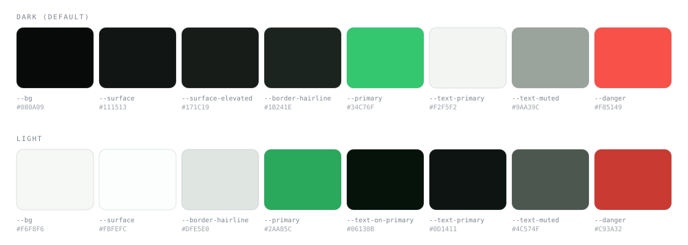

<p align="center">
  
</p>

<h1 align="center">Clover</h1>

<p align="center"><em>The same boards, threads and greentext. Without the 2003 interface.</em></p>

A redesign of 4chan built on Laravel, Inertia and React. Fly through boards that keep bump order instead of an algorithm, read threads where greentext still works, send a thread to somebody without an account following you around, and browse it all in a design system authored once in OKLCH and derived into two themes.

## Overview

4chan's information architecture has aged well. Its interface has not.

Clover treats the underlying model as correct: anonymous posting, subject-scoped boards, bump-order ranking, human moderation. What changes is everything a person actually touches. A real type scale, a colour system where both themes fall out of one set of values, and components that are keyboard operable and readable by a screen reader, because an imageboard read at 2am on a phone is no place to be precious about accessibility.

The design lives in a Claude Design project and is treated as a blueprint, not a spec. Where the prototype and good practice disagree, good practice wins and the departure is written down. The prototype animates the sidebar's `width` on collapse, so the width snaps and only colour transitions. Its light theme sets button text to `#FFFFFF`, which measures 3.06:1 against the light green and fails WCAG AA, so the authored `#06130B` ships instead at 6.20:1. Its `Switch` animates `justify-content` to slide the thumb, so the thumb translates.

Some of it is not a port at all. The prototype has no command palette, no thread page and no composer: it stubs the last two with copy claiming the design system ships them, and it does not. Those are net-new work built to sit inside the system rather than beside it.

Boards, threads and posts are ingested from 4chan's read-only JSON API into Eloquent and reach the screens as Inertia props. Everything an account does — posting, voting, saving, following, and the reading history behind it — is this application's own and never leaves it. Clover is two data sources behind one set of typed contracts rather than a mirror.

## Features

- **Token foundation** &mdash; every colour authored once in OKLCH, mapped through Tailwind's `@theme` to both shadcn aliases and Clover-native utilities; dark by default with a fully authored light scope, and no neutral pure black or white
- **Component library** &mdash; 94 components across primitives, Clover-specific components, and page sections, each built test-first
- **Overlays on Radix** &mdash; dialog, dropdown, context menu, tabs, tooltip and select, so focus trapping, roving tabindex and typeahead are correct rather than approximated
- **Command palette** &mdash; ⌘K / Ctrl+K over `cmdk`, net-new work the design prototype never covered
- **App chrome** &mdash; collapsible sidebar with persisted state, sticky header with account and notification menus, and a mobile bottom bar that respects the home-indicator inset
- **Community layer** &mdash; thread cards with a stretched-link target so the share and bookmark buttons stay independently focusable, and a comment tree nested from quotelinks, since 4chan's own posts are flat
- **Feed, boards and threads** &mdash; three feed sorts, a board page per slug with a real empty state, and a thread view that handles a post number matching nothing as an ordinary case rather than an error
- **Real data, read-only upstream** &mdash; 77 boards, their catalogs and their posts ingested from 4chan's JSON API by `clover:sync`, rate limited to one request a second and conditional on `If-Modified-Since`; nothing is ever written back
- **Greentext that works** &mdash; post bodies are parsed from 4chan's HTML to plain text on ingest, then rendered line by line with quote lines styled and `>>` references picked out; no post body ever reaches React as markup
- **Adult boards behind an opt-in** &mdash; `ws_board` drives it, the preference is account-level and off by default, and a board you have not opted into answers 404 rather than 403 so its existence is not confirmed
- **Imageboard URLs** &mdash; `/g/` is a board and `/g/109522303` a thread, constrained to the synced slug list so they cannot shadow the site's own pages
- **Attachments that render** &mdash; images served straight from 4chan's CDN, addressed by the id it stores them under; spoilered files and everything on a not-worksafe board sit behind a cover that fetches nothing until asked
- **Composers that persist** &mdash; a reply form inline where replying belongs and a dialog for starting a thread, both refusing empty input, both enforcing the board's own `max_comment_chars` rather than one global guess, and both writing a post that survives a reload
- **An account layer of its own** &mdash; saved threads, reading history and followed boards, each private to the anon and none of it attached to anything they post. There is no voting: blessings and curses were removed in task 12, because 4chan has no votes to import and almost nothing cast here ever carried any
- **Marketing homepage** &mdash; hero, board grid, trending strip, features, and a footer whose every destination resolves to a real page
- **Accessibility as a build constraint** &mdash; focus rings never removed, state never carried by colour alone, tests asserting accessible names and keyboard paths instead of class strings
- **Motion that means something** &mdash; four duration tokens, exits at roughly 65% of their enter, layout properties never animated, and a reduced-motion rule asserted against the compiled stylesheet
- **Two variable fonts** &mdash; Inter and Space Grotesk, subset to WOFF2; no monospace ships, and machine values use Inter with tabular figures

## Tech stack

| Layer | Technology |
|---|---|
| Framework | [Laravel 13](https://laravel.com) · PHP 8.4 · [Inertia 3](https://inertiajs.com) |
| Frontend | [React 19](https://react.dev) · TypeScript 5.7 (strict) · [Vite 8](https://vite.dev) |
| Styling | [Tailwind CSS v4](https://tailwindcss.com) (`@theme`, no config file) · class-variance-authority · tw-animate-css |
| Components | [Radix UI](https://radix-ui.com) primitives · [cmdk](https://cmdk.paco.me) · [Sonner](https://sonner.emilkowal.ski) · [Lucide](https://lucide.dev) icons |
| Auth | [Laravel Fortify](https://laravel.com/docs/fortify) · two-factor · passkeys |
| Routing | [Wayfinder](https://github.com/laravel/wayfinder) typed route helpers |
| Database | SQLite · Eloquent |
| Upstream data | [4chan read-only JSON API](https://github.com/4chan/4chan-API) · scheduled ingest |
| Testing | [Pest 4](https://pestphp.com) · [Vitest 4](https://vitest.dev) · Testing Library |
| Quality | Larastan (level 7) · Pint · ESLint 9 · Prettier 3 |

## Brand

The identity is one green on a near-black field. Space Grotesk carries the wordmark and headings, Inter carries body text, and machine values (post numbers, board slugs, byte counts) use Inter with tabular figures so digit columns hold still as counts change. There is no monospace font: tabular figures were what monospace was doing here anyway.

Green marks state and action. It is never a page background and never a large fill.

### Surfaces

Backgrounds were flat: no gradient, pattern, texture or grain anywhere. That rule is now amended, and the amendment is narrow. What is allowed is **structure** &mdash; a dot matrix on the layout's own module, drawn with a hard-stop gradient that paints a dot and stops. What the rule was written against, the colour wash and the soft ramp behind a heading, is still out, and so are texture and grain.

One matrix, one colour, everywhere: the homepage header, every band, the footer, the signed-in app shell, and the form half of the auth screens. A second colour was tried and removed. It had to be loud to be seen at all at this dot size, and loud is exactly what made the text harder to read.

`PatternField` owns it. The pattern sits on its own layer and drifts against the content as a band passes, because a background painted on the element holding the text scrolls locked to that text and reads as noise under it. The travel is dropped for anyone who asked for less motion; the pattern is not.

Content columns are ruled on all four sides, and adjacent bands share their horizontal rules, so a stack of them draws one continuous frame rather than a row of boxes with doubled edges between.

### Color palette



Colours are authored in OKLCH, which keeps lightness perceptually even across hues and lets both themes derive from one set of decisions. Hex below is the sRGB equivalent, for reference only. All tokens live in [`resources/css/app.css`](resources/css/app.css); components consume semantic utilities (`bg-surface`, `text-faint`, `border-border`), so the theme retunes in one place.

| Token | Role | OKLCH | Hex |
|---|---|---|---|
| Field | `--bg` (dark) | `oklch(14.18% 0.0042 165.2)` | `#080A09` |
| Surface | `--surface` (dark) | `oklch(19.06% 0.0074 164.1)` | `#111513` |
| Primary | `--primary` (dark) | `oklch(73.37% 0.1751 152.1)` | `#34C76F` |
| Text | `--text-primary` (dark) | `oklch(96.7% 0.0051 145.5)` | `#F2F5F2` |
| Muted | `--text-muted` (dark) | `oklch(70.61% 0.0143 152.5)` | `#9AA39C` |
| Field | `--bg` (light) | `oklch(97.71% 0.0034 145.5)` | `#F6F8F6` |
| Primary | `--primary` (light) | `oklch(64.67% 0.1552 151.9)` | `#2AA85C` |
| On primary | `--text-on-primary` | `oklch(17.12% 0.0256 156.5)` | `#06130B` |
| Danger | `--danger` (dark) | `oklch(66.51% 0.2046 27)` | `#F85149` |
| Warning | `--warning` (dark) | `oklch(74.53% 0.1453 85.2)` | `#D6A420` |

Two rules the palette enforces. No neutral is pure white or black, every one is tinted toward the brand hue so surfaces read as a family. And `--text-on-primary` stays dark in both themes: white on the light green measures 3.06:1 and fails WCAG AA, where the dark value measures 6.20:1. A test asserts this and fails if anyone reintroduces white.

### Brand icon

The mark is a single glyph, drawn once in [`resources/js/components/clover/wordmark.tsx`](resources/js/components/clover/wordmark.tsx) and reused wherever it appears:

- `Mark` &mdash; the glyph alone, used in the collapsed sidebar rail
- `Wordmark` &mdash; the glyph plus the word `clover`, always lowercase, used in the expanded sidebar, the homepage nav and the footer
- [`public/favicon.svg`](public/favicon.svg) &mdash; the same glyph in near-black on a brand-green rounded square

The prototype masks a PNG for the glyph. A raster mask cannot recolour cleanly across two themes and costs a request for one shape, so the app uses a vector icon that both themes can tint.

## Local setup

**Prerequisites:** PHP 8.4+, Node 22+, Composer. The database is SQLite and is created on first migrate. No API keys or paid accounts required.

```bash
# 1. Clone
git clone https://github.com/NightServant/4chan-redesign.git
cd 4chan-redesign

# 2. Install both dependency trees, copy .env, generate a key, migrate, build
composer setup

# 3. Pull every board and its threads from 4chan (77 requests, about a minute)
php artisan clover:sync

# 4. Run the dev server
composer dev
```

Step 3 is one request per board and gets a fully readable site: `catalog.json`
returns every thread on a board along with its opening post, so boards, cards,
titles, excerpts and images are all populated by it. Replies need the thread
endpoint, which is a request per thread and off by default — add
`--with-posts` for it, and `--board=g --limit=5` to keep a first run short.

Without step 3 the site runs and every route resolves, but there are no boards
and the feed says so.

Open [http://localhost:8000](http://localhost:8000). Served by [Laravel Herd](https://herd.laravel.com) at `https://4chan-redesign.test` if you use it.

> **Note:** the site renders without a running queue or cache. If a page 500s after a fresh pull, run `npm run build` first: Pest asserts against the compiled stylesheet and skips those checks when assets are unbuilt.

### Useful commands

```bash
composer ci:check        # everything CI runs, in one command

npm run test:js          # Vitest
php artisan test         # Pest
npm run types:check      # tsc --noEmit
composer types:check     # Larastan, level 7
npm run lint             # ESLint, with --fix
npm run format           # Prettier
vendor/bin/pint          # PHP formatting
```

## Progress

Work is sequenced into gated tasks. Each is built, reviewed, merged to `main` as one squashed commit, and verified on `main` before the next begins. **Current suite: 836 frontend tests, 296 backend tests.**

| Task | Scope | Status |
|---|---|---|
| 1 | Design foundation: OKLCH tokens, both theme scopes, two variable fonts, typed contracts | [Merged](https://github.com/NightServant/4chan-redesign/pull/4) |
| 2 | Core primitives and form controls | [Merged](https://github.com/NightServant/4chan-redesign/pull/7) |
| 3 | Overlays, navigation, feedback; command palette | [Merged](https://github.com/NightServant/4chan-redesign/pull/8) |
| 4 | App chrome and Inertia layouts; breadcrumbs and the shadcn sidebar removed | [Merged](https://github.com/NightServant/4chan-redesign/pull/9) |
| 5 | Community layer: thread cards, votes, comment tree, skeletons | [Merged](https://github.com/NightServant/4chan-redesign/pull/10) |
| 6 | Homepage, plus eleven information routes | [Merged](https://github.com/NightServant/4chan-redesign/pull/11) |
| 6.1 | Visual fixes from review: rail alignment, hero overlap, header backdrop | [Merged](https://github.com/NightServant/4chan-redesign/pull/12) |
| 7 | Feed and board pages; board and thread routing | [Merged](https://github.com/NightServant/4chan-redesign/pull/15) |
| 8 | Thread view, reply composer, new-thread dialog, auth gate | [Merged](https://github.com/NightServant/4chan-redesign/pull/16) |
| 8.1 | Review fixes: Home resolves by auth state, feed sort tabs removed | [Merged](https://github.com/NightServant/4chan-redesign/pull/17) |
| 9 | Account, history, auth screens, error pages | [Merged](https://github.com/NightServant/4chan-redesign/pull/19) |
| 10 | The six screens the prototype never covered: settings, messages, bookmarks, communities, two-factor, passkeys | [Merged](https://github.com/NightServant/4chan-redesign/pull/19) |
| 11a | Read layer: ingest from 4chan's API, board and thread models, per-board limits, mature-board gating | [Merged](https://github.com/NightServant/4chan-redesign/pull/20) |
| 11a.1 | Attachments rendered from 4chan's CDN, behind spoiler and mature-board covers | [Merged](https://github.com/NightServant/4chan-redesign/pull/21) |
| 11a.2 | Image sizing; no attachments on the homepage | [Merged](https://github.com/NightServant/4chan-redesign/pull/22) |
| 11a.3 | Whole catalog imported, opening post with it | [Merged](https://github.com/NightServant/4chan-redesign/pull/23) |
| 11b | Account layer: votes, bookmarks, history, subscriptions, local posting; messages removed | [Merged](https://github.com/NightServant/4chan-redesign/pull/25) |
| 12 | Blessings and curses retired, table and all; sharing a thread in their place | [Merged](https://github.com/NightServant/4chan-redesign/pull/29) |
| 13a | Hero rebuilt around live thread rails; light-theme green fixed; boards as a carousel | [Merged](https://github.com/NightServant/4chan-redesign/pull/30) |
| 13b | Features as tabs; footer cut to what Clover has, with the pages written | [Merged](https://github.com/NightServant/4chan-redesign/pull/31) |
| 13c | Patterns in the design system, parallax bands, ticker-speed marquees, trending as a ticker | [Merged](https://github.com/NightServant/4chan-redesign/pull/32) |
| 13d | One pattern throughout, ruled columns, legible boxed marquee rows | [Merged](https://github.com/NightServant/4chan-redesign/pull/33) |
| 13e | Dots alternate green and grey; hero rails ruled both sides | [Merged](https://github.com/NightServant/4chan-redesign/pull/34) |
| 13f | Second dot colour dropped; one colour on the paper | [Merged](https://github.com/NightServant/4chan-redesign/pull/35) |
| 13g | Paper extended to the app shell and the auth form side | [Merged](https://github.com/NightServant/4chan-redesign/pull/36) |
| 14 | Search that works: header dropdown and a results page, over the synced database | [Merged](https://github.com/NightServant/4chan-redesign/pull/37) |
| 15 | Threads as rows rather than cards; images shown whole; NSFW marked | [Merged](https://github.com/NightServant/4chan-redesign/pull/38) |
| 15a | Paper on the app chrome; search aligned to the thread column; hover on the title | [Merged](https://github.com/NightServant/4chan-redesign/pull/39) |
| 16 | Sidebar carries the board lists; New Thread removed; bookmarking actually works | [Merged](https://github.com/NightServant/4chan-redesign/pull/40) |
| 17 | Appearance page removed; adult boards and two-factor in the avatar menu; history as rows | Open |

The app is navigable end to end: homepage, feed, board, thread, reply. Every link resolves, and everything an account does persists.

There are no design fixtures left. `resources/js/fixtures/` holds test-data
builders and nothing else — every product surface reads the database.

### Known gaps

- **Nothing has been checked in a browser by eye.** Every route is asserted to render and the write paths are covered end to end, but no one has looked at the result. Historically on this project the defects that mattered came from screenshots, not from the suite.
- **`NewThreadDialog` is mounted by nothing.** Starting a thread works over its route and is covered by tests, but no screen renders the dialog, so the feature is unreachable from the interface.
- **The feed does not page.** It is one query with a limit. The previous "Load more" was removed rather than kept, because it showed two skeletons and put itself back — paging a server-backed feed needs a cursor on the prop.
- **Reading progress is always nought.** The thread page records that a thread was read but does not measure how far, so the history screen's progress ring is honest and uninformative. Inventing a number would be worse.
- **Clover accepts no uploads.** A post written here carries no attachment, which is why the account screen's media tab is empty for a new account.
- **`php artisan route:cache` freezes the board list.** The `/{board}` constraint is built from the synced table, so a deployment that caches routes must re-cache them after a sync adds boards.

## Data notes

Board, thread and post content is **real, and comes from 4chan**, via its [read-only JSON API](https://github.com/4chan/4chan-API). It is fetched server-side, at most one request a second with `If-Modified-Since` as the API's documentation asks, and nothing is ever sent upstream — the API accepts `GET`, `HEAD` and `OPTIONS` only. Everything an anon does here stays in this application's database.

Post bodies are parsed to plain text on the way in. The API returns `com` as HTML written by anonymous strangers — `<br>`, `<wbr>` injected mid-URL, greentext spans, three shapes of quotelink and HTML entities — so it is converted once during ingest rather than trusted into the DOM at render time. No post body reaches React as markup, and the renderer uses no `dangerouslySetInnerHTML`. (One component does: the two-factor setup modal, for the QR code SVG Fortify generates server-side. That is the app's own output, not an anon's.)

**Attachments are real images, served by 4chan.** Files are addressed by `tim`, 4chan's own id for them, and the `` points straight at `i.4cdn.org` — the documented arrangement, and what any client does. Nothing is downloaded or stored here: the application holds the id of a file, not the file. A browser fetching one therefore contacts 4chan directly, and `referrerPolicy="no-referrer"` keeps which page an anon was reading out of it.

**A covered attachment is never fetched.** Images 4chan marks `spoiler`, and every image on a board marked not worksafe, render as a labelled cover with no `src` at all until an anon asks for one. Blurring a file the browser has already downloaded conceals nothing — the bytes arrived and the request happened. The homepage carries no attachments in its payload whatsoever, so the first screen a visitor sees cannot make a request to the CDN.

Boards 4chan marks `ws_board: 0` are hidden unless an anon opts in, and a signed-out visitor always gets the filtered view. Requesting one you have not opted into returns 404 rather than 403, so the board's existence is not confirmed to someone who asked not to see boards like it.

Several figures the design carried were removed rather than estimated, because nothing publishes them: a per-board "anons online" count, per-thread views, and the rail's site-wide presence panel. Where a number has no source it is not shown. The same rule took the profile's achievement badges and its janitor scope — one measured nothing, the other named a moderation system that does not exist — and emptied the rail's moderation panel, which had claimed a specific live board was under slow mode.

**Everything an account does is its own, and private.** Saved threads, reading history and followed boards are visible to nobody else, and a post carries no identity at all: a reply written here is `Anonymous` whoever wrote it, and the only thing that can appear beside it is a tripcode an anon opted into. Nothing is ever sent upstream — the API accepts `GET`, `HEAD` and `OPTIONS` only — so a reply written on Clover stays on Clover.

Direct messages were removed rather than built. Two anons have no way to find each other here: there is no directory, no profile page for anyone but yourself, and no identity on a post to start from. The screen assumed a social graph the product's own premise rules out.

Fonts are Inter and Space Grotesk, both under the SIL Open Font License, vendored and subset to WOFF2. Icons are Lucide, ISC licensed.

## Licence

No licence has been chosen yet, so default copyright applies and the code is not yet free to reuse. A licence file will land before the project is considered finished.

Clover is an independent redesign exercise and is not affiliated with 4chan.
